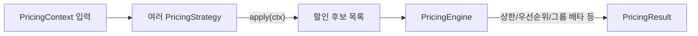

# 전략(Strategy) 패턴 — 주문 할인 계산 도메인 예제 (TypeScript)

> **목표**: 조건문(if/switch) 난립을 없애고, 새로운 할인 정책을 추가할 때 기존 코드를 건드리지 않도록(Open-Closed Principle) 설계합니다. 또한 각 전략을 개별적으로 **테스트 가능**하고, 실무 서비스(예: NestJS)에도 쉽게 붙도록 만듭니다.

---

## 1) 왜 전략 패턴인가?

-   **문제상황**: 비즈니스 규칙(할인 정책 등)이 계속 늘어날 때 `if-else/switch`가 급격히 복잡해짐.
-   **해결의지**: “변하는 부분(전략)”을 인터페이스로 추상화하고, 구체 정책은 각 **전략 객체**로 분리.
-   **효과**
    -   👉 새 정책 추가 시 **새 클래스만 추가** (기존 계산 로직은 수정 최소화)
    -   👉 조합/우선순위/상한선 등의 정책은 **엔진(PricingEngine)** 한 곳에서 제어
    -   👉 각 전략이 독립적이라 **단위 테스트**가 쉬움

---

## 2) 시나리오

-   입력: 단가, 수량, 회원 등급, 쿠폰 등
-   정책: 신규회원 할인, 등급별 할인, 쿠폰(정액/정률), 대량구매 할인 … (계속 증가 가능)
-   출력: 소계, 적용된 할인 항목들, 최종 결제 금액

---

## 3) 설계 개요



-   **PricingStrategy**: “적용 가능 여부 + 할인액 계산”만 책임.
-   **PricingEngine**: 전략들을 **합성**해서 최종 할인 목록/금액을 산출. (상한, 최적 1개 선택 등)
-   **StrategyRegistry**: 문자열 키로 전략을 관리(동적 선택/조합용).

---

## 4) 폴더 구조(예시)

```
strategy-pattern/
├─ types.ts
├─ pricing-engine.ts
├─ strategy-registry.ts
├─ strategies/
│  ├─ basic.strategy.ts              // NoDiscountStrategy
│  ├─ new-member.strategy.ts         // 신규회원 할인
│  ├─ tier.strategy.ts               // 등급별 할인
│  ├─ coupon.strategy.ts             // 쿠폰(정액/정률)
│  └─ bulk.strategy.ts               // 대량구매 할인
└─ example-run.ts
```

> 실무에서는 각 전략을 별도 파일로 두고, 테스트도 파일 단위로 쪼개는 것을 권장합니다.

---

## 5) 핵심 타입

```ts
// types.ts
export type MemberTier = 'NEW' | 'IRON' | 'BRONZE' | 'SILVER' | 'GOLD' | 'PLATINUM'

export interface PricingContext {
    basePrice: number // 단품 가격
    quantity: number // 구매 수량
    memberTier?: MemberTier
    coupon?: {
        type: 'AMOUNT' | 'RATE' // 정액 / 정률
        value: number // 5, 10(%) ...
    }
    now?: Date // 시즌/기간 할인 등에 사용 (선택)
}

export interface DiscountResult {
    label: string // "신규회원 5% 할인" 등
    amount: number // 할인 금액(양수): 3,000원 할인 → 3000
    meta?: Record<string, any>
    group?: 'membership' | 'coupon' | 'bulk'
}

export interface PricingResult {
    subtotal: number // 원가 * 수량
    discounts: DiscountResult[] // 적용된 각 할인
    total: number // 최종 결제 금액 (0원 미만 방지)
}

export interface PricingStrategy {
    /** 적용 가능하면 할인 금액을 반환, 아니면 0 */
    apply(ctx: PricingContext): DiscountResult | null
}
```

---

## 6) 개별 전략 (요약)

### 6-1) 신규회원 할인

```ts
// strategies/new-member.strategy.ts
export class NewMemberDiscountStrategy implements PricingStrategy {
    constructor(private readonly rate = 0.05) {}
    apply(ctx: PricingContext): DiscountResult | null {
        if (ctx.memberTier !== 'NEW') return null
        const subtotal = ctx.basePrice * ctx.quantity
        const amount = Math.floor(subtotal * this.rate)
        return amount > 0 ? { label: `신규회원 ${Math.floor(this.rate * 100)}% 할인`, amount, group: 'membership' } : null
    }
}
```

> **주의**: `memberTier: 'NEW'`이 아닌 경우 **신규회원 할인은 적용되지 않습니다.** (배타적)

### 6-2) 등급별 할인

```ts
// strategies/tier.strategy.ts
const TIER_RATE: Record<MemberTier, number> = { NEW: 0, SILVER: 0.02, GOLD: 0.05, VIP: 0.1 }
export class TierDiscountStrategy implements PricingStrategy {
    apply(ctx: PricingContext): DiscountResult | null {
        if (!ctx.memberTier) return null
        const rate = TIER_RATE[ctx.memberTier] ?? 0
        if (rate <= 0) return null
        const subtotal = ctx.basePrice * ctx.quantity
        const amount = Math.floor(subtotal * rate)
        return amount > 0 ? { label: `등급(${ctx.memberTier}) ${Math.floor(rate * 100)}% 할인`, amount, meta: { rate } } : null
    }
}
```

### 6-3) 쿠폰 할인 (정액/정률)

```ts
// strategies/coupon.strategy.ts
export class CouponDiscountStrategy implements PricingStrategy {
    apply(ctx: PricingContext): DiscountResult | null {
        const { coupon, basePrice, quantity } = ctx
        if (!coupon) return null
        const subtotal = basePrice * quantity
        let amount = 0
        let label = '쿠폰 할인'
        if (coupon.type === 'AMOUNT') {
            amount = Math.max(0, Math.floor(coupon.value))
            label = `쿠폰 정액 ${amount.toLocaleString()}원 할인`
        } else if (coupon.type === 'RATE') {
            amount = Math.floor(subtotal * (coupon.value / 100))
            label = `쿠폰 정률 ${coupon.value}% 할인`
        }
        return amount > 0 ? { label, amount, meta: { coupon } } : null
    }
}
```

### 6-4) 대량구매 할인

```ts
// strategies/bulk.strategy.ts
export class BulkPurchaseDiscountStrategy implements PricingStrategy {
    constructor(private readonly minQty = 10, private readonly amountOffPerItem = 100) {}
    apply(ctx: PricingContext): DiscountResult | null {
        if (ctx.quantity < this.minQty) return null
        const amount = ctx.quantity * this.amountOffPerItem
        return amount > 0
            ? {
                  label: `대량구매 ${this.minQty}개↑ 개당 ${this.amountOffPerItem}원 할인`,
                  amount,
                  meta: { minQty: this.minQty, amountOffPerItem: this.amountOffPerItem }
              }
            : null
    }
}
```

---

## 7) 전략 조합기 — `PricingEngine`

```ts
// pricing-engine.ts (핵심만 발췌)
export class PricingEngine {
    constructor(
        private readonly strategies: PricingStrategy[],
        private readonly options?: {
            maxDiscountRate?: number // 총 할인 상한 비율 (예: 0.3 = 30%)
            onlyBestOne?: boolean // true면 가장 큰 할인 1개만 적용
        }
    ) {}

    calculate(ctx: PricingContext): PricingResult {
        // 1) 소계 계산: 단가 * 수량
        const subtotal = ctx.basePrice * ctx.quantity
        // 2) 모든 전략 실행 → 0원 초과인 유효 할인만 수집 (Null 안전: 타입 가드로 DiscountResult[] 확보)
        const applied: DiscountResult[] = this.strategies.map((s) => s.apply(ctx)).filter((r): r is DiscountResult => !!r && r.amount > 0)

        // 3) 옵션: 가장 큰 할인 하나만 남기기
        let selected = applied
        if (this.options?.onlyBestOne && applied.length > 0) {
            // 가장 큰 할인만 선별(정렬로 최댓값 선택)
            const best = [...applied].sort((a, b) => b.amount - a.amount)[0]!
            selected = [best]
        }

        // 4) 총 할인 상한(옵션): 선택된 할인들의 합을 계산하고 상한액을 구한다
        const totalRaw = selected.reduce((sum, d) => sum + d.amount, 0)
        // 상한액: 옵션이 주어지면 floor(소계 * 상한율), 아니면 무한대(상한 없음)
        const maxByRate = typeof this.options?.maxDiscountRate === 'number' ? Math.floor(subtotal * this.options.maxDiscountRate) : Infinity
        const totalDiscount = Math.min(totalRaw, maxByRate)

        // 5) 상한으로 잘려나간 경우, 각 항목의 비중(개별/총합)에 따라 금액을 재분배한다
        //    주의: Math.floor로 인해 총합이 소폭 줄 수 있다(잔여 보정 없음)
        const discounts =
            totalRaw > 0 && totalDiscount < totalRaw
                ? selected.map((d) => ({
                      ...d,
                      amount: Math.floor((d.amount / totalRaw) * totalDiscount)
                  }))
                : selected

        // 6) 최종 결제 금액: 소계 - 총할인, 음수는 0으로 방지
        const total = Math.max(0, subtotal - discounts.reduce((s, d) => s + d.amount, 0))

        return { subtotal, discounts, total }
    }
}
```

> **TIP(정밀 분배)**: 정수 반올림으로 합계가 1~2원 틀어질 수 있습니다. 마지막 항목에 `남은 금액`을 더하는 방식으로 보정하면 합계가 정확해집니다.

---

## 8) 전략 레지스트리 — `StrategyRegistry`

```ts
// strategy-registry.ts (요약)
export class StrategyRegistry {
    private registry = new Map<string, PricingStrategy>()
    register(key: string, strategy: PricingStrategy) {
        if (this.registry.has(key)) throw new Error(`Duplicate strategy key: ${key}`)
        this.registry.set(key, strategy)
    }
    get(key: string): PricingStrategy {
        const s = this.registry.get(key)
        if (!s) throw new Error(`Strategy not found: ${key}`)
        return s
    }
    list(): string[] {
        return [...this.registry.keys()]
    }
}
```

-   분기를 `switch(key)`가 아닌 **맵 조회**로 대체.
-   A/B 테스트나 플래그 기반 전략 On/Off가 쉬워짐.

---

## 9) 실행 예시 (`run.ts`)

```ts
const registry = new StrategyRegistry()
registry.register('coupon', new CouponDiscountStrategy())
registry.register('newMember', new NewMemberDiscountStrategy(0.07))
registry.register('tier', new TierDiscountStrategy())
registry.register('bulk', new BulkPurchaseDiscountStrategy(10, 100))

const strategies = ['newMember', 'tier', 'coupon', 'bulk'].map((k) => registry.get(k))
const engine = new PricingEngine(strategies, { maxDiscountRate: 0.3, onlyBestOne: false })

const ctx: PricingContext = {
    basePrice: 12000,
    quantity: 12,
    memberTier: 'GOLD', // GOLD이면 신규회원 할인은 적용 X
    coupon: { type: 'RATE', value: 10 }
}

const result = engine.calculate(ctx)
console.log(result)
```

**예상 결과(요지)**

-   소계: `144,000원`
-   할인:
    -   등급(GOLD) 7% → `-10,080원`
    -   쿠폰 정률 10% → `-14,400원`
    -   대량구매(10개↑ × 100원) → `-1,200원`
-   총할인: `25,680원` (상한 30% = 43,200원 이하이므로 캡 안 됨)
-   최종 결제금액: `118,320원`

---

## 10) 선택적 확장 아이디어

-   **그룹 배타(exclusive group)**: `DiscountResult`에 `group?: string`을 두고, 같은 그룹 내에서는 가장 큰 할인 1개만 남기도록 엔진에서 처리(예: `membership` 그룹: 신규 vs 등급 중 하나).
-   **우선순위(Priority)**: 전략에 `priority`를 두고 정렬 후 적용.
-   **조건부 활성화**: 플래그/환경변수/기간(now) 기반 전략 활성화/비활성화.
-   **로깅/트레이싱**: 각 전략의 적용/미적용 사유를 기록해 CS/분석에 활용.

> 현재 샘플 코드는 `maxDiscountRate`, `onlyBestOne` 옵션까지 포함합니다. 그룹 배타는 도입 시 `group` 필드를 추가하고 엔진에서 그룹별 최대 1개만 남기도록 확장하면 됩니다.

---

## 11) NestJS 통합 팁

-   각 전략을 `@Injectable()`로 만들고 DI 컨테이너에 등록.
-   `StrategyRegistry`를 앱 초기화 시점에 구성하여 Provider로 노출.
-   도메인 서비스(AppService 등)가 `PricingEngine`을 주입 받아 사용.
-   유닛 테스트: 전략은 단위 테스트, 엔진은 조합/옵션 단위로 테스트.

---

## 12) 체크리스트

-   [ ] 새 정책 추가 시 **새 전략 클래스**만 만들면 되는가?
-   [ ] 외부 I/O 없는 **순수 계산**으로 유지되어 테스트가 쉬운가?
-   [ ] 상한/우선순위/배타 등의 정책을 **엔진 옵션**으로 제어하는가?
-   [ ] 로깅/메타데이터로 할인 근거를 추적할 수 있는가?

---

## 13) 마무리

전략 패턴은 **조건 분기 제거**가 목적이 아니라, *변경에 강한 구조*를 만드는 것이 핵심입니다. 본 예제는 **할인 도메인**이지만,

-   결제 라우팅(카드/간편/포인트),
-   배송비 계산(지역/무게/부피),
-   검증 파이프라인(권한/형식/도메인 룰)
    등 다양한 곳에 그대로 응용할 수 있습니다.
