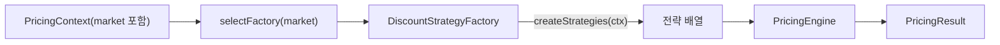

# 팩토리 메서드(Factory Method) 패턴 — 마켓별 할인 전략 조합 (TypeScript)

> **목표**: “전략을 어떤 조합/파라미터로 쓸지”의 책임을 팩토리에 위임합니다. 런타임 입력(`market`)에 따라 다른 전략 배열을 생성하고, 엔진은 계산만 책임지게 분리합니다. 새로운 마켓/규칙이 추가되어도 기존 계산 로직을 최소 수정(OCP)으로 유지합니다.

---

## 1) 왜 팩토리 메서드인가?

-   **문제상황**: 국가/도메인/비즈니스 라인마다 할인 전략 조합이 달라짐 → `if (market===KR) ... else if ...` 분기가 커짐.
-   **해결의지**: “전략 생성(선정+파라미터)”을 팩토리 클래스로 캡슐화. 호출자는 `factory.createStrategies(ctx)`만 알면 됨.
-   **효과**
    -   👉 마켓별 규칙 변경 시, 해당 팩토리 클래스만 수정
    -   👉 엔진(`PricingEngine`)은 합산/상한/우선순위 등 계산 로직에 집중
    -   👉 단위 테스트가 팩토리/엔진/전략으로 자연스럽게 분리

---

## 2) 시나리오

-   입력: 단가, 수량, 회원 등급, 쿠폰, 마켓(`KR`/`GLOBAL`)
-   정책: 신규회원, 등급, 쿠폰(정액/정률), 대량구매
-   출력: 소계, 적용 할인 목록, 최종 결제 금액

---

## 3) 설계 개요



-   **DiscountStrategyFactory**: "어떤 전략들을 어떤 인자로 만들 것인가" 결정
-   **PricingEngine**: 전달받은 전략들을 실행·합산(상한/단일최대 등 옵션 반영)

---

## 4) 폴더 구조(예시)

```
2.factory-method/
├─ engine/
│  └─ pricing-engine.ts
├─ factory/
│  ├─ base.factory.ts            // DiscountStrategyFactory 추상화
│  ├─ korea.factory.ts           // KR 규칙 (신규 + 쿠폰 + 대량구매 100원)
│  ├─ global.factory.ts          // GLOBAL 규칙 (등급 + 쿠폰 + 대량구매 150원)
│  └─ selector.ts                // market → factory 선택
├─ strategies/
│  ├─ new-member.strategy.ts
│  ├─ tier.strategy.ts
│  ├─ coupon.strategy.ts
│  └─ bulk.strategy.ts
├─ type/
│  └─ types.ts
└─ run.ts
```

> 실무에서는 팩토리/전략/엔진을 각각 테스트 단위로 쪼갭니다.

---

## 5) 핵심 타입(발췌)

```ts
// type/types.ts
export type Market = 'KR' | 'GLOBAL'

export interface PricingStrategy {
    apply(ctx: PricingContext): DiscountResult | null
}

export abstract class DiscountStrategyFactory {
    abstract createStrategies(ctx: PricingContext): PricingStrategy[]
}

export function selectFactory(market: Market): DiscountStrategyFactory

export interface PricingEngineOptions {
    maxDiscountRate?: number // 0.3 = 총 30% 상한
    onlyBestOne?: boolean // true면 가장 큰 할인 1개만 적용
}
```

---

## 6) 팩토리 구현(요약)

```ts
// factory/korea.factory.ts
export class KoreaDiscountFactory extends DiscountStrategyFactory {
    createStrategies(ctx: PricingContext): PricingStrategy[] {
        return [new NewMemberDiscountStrategy(0.05), new CouponDiscountStrategy(), new BulkPurchaseDiscountStrategy(10, 100)]
    }
}
```

```ts
// factory/global.factory.ts
export class GlobalDiscountFactory extends DiscountStrategyFactory {
    createStrategies(ctx: PricingContext): PricingStrategy[] {
        return [new TierDiscountStrategy(), new CouponDiscountStrategy(), new BulkPurchaseDiscountStrategy(10, 150)]
    }
}
```

---

## 7) 엔진(핵심만)

```ts
export class PricingEngine {
    constructor(
        private readonly strategies: PricingStrategy[],
        private readonly options?: { maxDiscountRate?: number; onlyBestOne?: boolean }
    ) {}
    // calculate(ctx): 할인 후보 수집 → 옵션(단일최대/상한) → 합산
}
```

> 상한이 걸리면 각 할인액의 비중으로 재분배합니다. 정수 반올림으로 1~2원 오차가 생기면 마지막 항목에 보정액을 더하는 방식으로 맞출 수 있습니다.

---

## 8) 실행 예시 (`run.ts`)

```ts
const engineOpts: PricingEngineOptions = { maxDiscountRate: 0.3 }
const engineKR = new PricingEngine(createStrategiesByMarket(ctxKR), engineOpts)
console.log(engineKR.calculate(ctxKR))
```

**KR**: basePrice=12,000, qty=12, NEW, 쿠폰 10%

-   소계: 144,000
-   할인: 신규회원 5% = 7,200 / 쿠폰 10% = 14,400 / 대량구매 = 1,200
-   총할인 = 22,800 (상한 30% = 43,200 이내)
-   총액 = 121,200

**GLOBAL**: basePrice=20,000, qty=15, GOLD, 쿠폰 15%

-   소계: 300,000
-   할인: 등급 10% = 30,000 / 쿠폰 15% = 45,000 / 대량구매 = 2,250
-   총할인 = 77,250 (상한 30% = 90,000 이내)
-   총액 = 222,750

실행:

```bash
npm i
npx tsx 2.factory-method/run.ts
```

---

## 9) 확장 아이디어

-   **신규 마켓 추가**: 새 팩토리 클래스 → `selectFactory` 분기 추가
-   **조합 변경**: 팩토리 내부 전략 배열/파라미터만 수정
-   **실험/AB**: 환경변수/플래그에 따라 서로 다른 팩토리 선택
-   **엔진 옵션**: `onlyBestOne`/상한율 조정으로 정책 변화에 대응

---

## 10) NestJS 통합 팁

-   팩토리를 `@Injectable()`로 두고, 마켓 선택 로직을 서비스에서 주입
-   전략들은 순수 계산 클래스 유지(테스트 용이) → 구성만 DI로 교체
-   팩토리/엔진/전략 각각을 단위 테스트

---

## 11) 체크리스트

-   [ ] 마켓별 전략 조합이 **팩토리 클래스**에만 존재하는가?
-   [ ] 엔진은 계산 로직만 책임지는가(상한/단일최대 등)?
-   [ ] 신규 시장/프로모션 요구에 **분기 추가 없이** 팩토리로 대응 가능한가?

---

## 12) 주의/메모

-   `run.ts`의 `exclusiveGroups`/`roundingFix`는 예시 값이며 현재 엔진에서 사용하지 않습니다. 필요 시 엔진 옵션/로직을 확장하세요.
-   `tier.strategy.ts`의 등급 맵과 `type/types.ts`의 등급 타입이 완전히 일치하지 않습니다(예: BRONZE/PLATINUM vs VIP). 실사용에 맞게 정합성을 맞추세요.

## Factory Method: 마켓별 할인 전략 생성

목표: 할인 전략 선정(생성) 책임을 팩토리로 위임해, 마켓(국가/도메인)별로 다른 조합을 유연하게 구성한다. 실행 시점에 `market`에 맞는 팩토리를 선택해 `PricingEngine`으로 전달한다.

### 폴더 구조

-   **engine**: `PricingEngine` — 여러 `PricingStrategy`를 합성해 최종 금액 계산
-   **factory**: `DiscountStrategyFactory` 추상화와 `KoreaDiscountFactory`/`GlobalDiscountFactory`, `selectFactory`
-   **strategies**: 개별 할인 전략들 (신규회원, 등급, 쿠폰, 대량구매 등)
-   **type**: 컨텍스트/결과/전략 인터페이스 정의

### 핵심 개념

-   **Factory Method**: 마켓별로 어떤 전략들을 사용할지(그리고 어떤 파라미터로 생성할지) 팩토리가 결정한다.
-   **Engine**: 전달받은 전략 리스트를 실행하고 합산/상한 처리한다.

### 주요 타입/인터페이스

```ts
// 전략 인터페이스
export interface PricingStrategy {
    apply(ctx: PricingContext): DiscountResult | null
}

// 팩토리 추상화
export abstract class DiscountStrategyFactory {
    abstract createStrategies(ctx: PricingContext): PricingStrategy[]
}

// 팩토리 선택자
export function selectFactory(market: Market): DiscountStrategyFactory

// 엔진 옵션(핵심)
interface PricingEngineOptions {
    maxDiscountRate?: number // 총 할인 상한 비율(예: 0.3 = 30%)
    onlyBestOne?: boolean // true면 가장 큰 할인 하나만 적용
}
```

### 마켓별 전략 예시

-   **KR**(`KoreaDiscountFactory`): 신규회원 정률 + 쿠폰 + 대량구매(10개↑, 개당 100원)
-   **GLOBAL**(`GlobalDiscountFactory`): 등급 정률 + 쿠폰 + 대량구매(10개↑, 개당 150원)

### 실행 방법

프로젝트 루트에서:

```bash
npm i
npx tsx 2.factory-method/run.ts
```

### 예제 입력/출력

`run.ts`는 두 케이스를 실행한다.

-   KR: basePrice=12000, qty=12, NEW, 쿠폰 10%

    -   소계: 144,000
    -   할인: 신규회원 5% = 7,200 / 쿠폰 10% = 14,400 / 대량구매 = 1,200
    -   합계 할인 = 22,800 (상한 30% = 43,200 이내)
    -   총액 = 121,200

-   GLOBAL: basePrice=20000, qty=15, GOLD, 쿠폰 15%
    -   소계: 300,000
    -   할인: 등급 10% = 30,000 / 쿠폰 15% = 45,000 / 대량구매 = 2,250
    -   합계 할인 = 77,250 (상한 30% = 90,000 이내)
    -   총액 = 222,750

콘솔 출력 예(형식화):

```json
{
    "subtotal": 144000,
    "discounts": [
        { "label": "신규회원 5% 할인", "amount": 7200 },
        { "label": "쿠폰 정률 10% 할인", "amount": 14400 },
        { "label": "대량구매 10개↑ 개당 100원 할인", "amount": 1200 }
    ],
    "total": 121200
}
```

### 확장 방법(실전 체크리스트)

1. 새로운 전략 추가: `strategies/`에 `PricingStrategy` 구현체 작성 → 필요 파라미터는 생성자 주입
2. 마켓 규칙 변경: 해당 팩토리(`factory/*.factory.ts`)의 `createStrategies`에서 전략 배열/파라미터 조정
3. 신규 마켓 추가: 새 팩토리 클래스 작성 → `selectFactory`에 분기 추가
4. 엔진 동작 변경: `engine/pricing-engine.ts`의 옵션/상한/분배 로직 수정

### 설계 포인트

-   팩토리는 “어떤 전략을, 어떤 인자로” 생성할지 결정한다. 엔진은 전략의 실행과 합산에만 집중한다.
-   상한 적용 시 각 할인액 비중으로 재분배해 형평성을 유지한다.
-   `onlyBestOne` 옵션으로 단일 최댓값 할인만 적용하는 시나리오도 쉽게 지원 가능.

### 주의/메모

-   현재 `run.ts`의 `exclusiveGroups`, `roundingFix`는 예시 값이며 엔진에서 사용하지 않는다. 필요 시 엔진 옵션/로직에 반영하라.
-   `tier.strategy.ts`의 등급 맵과 `type/types.ts`의 등급 타입 정의가 완전히 일치하지 않는다(예: BRONZE/PLATINUM vs VIP). 실사용에 맞게 정합성을 맞추는 것을 권장.

### 관련 파일 빠른 참조

```12:18:2.factory-method/run.ts
const engineKR = new PricingEngine(createStrategiesByMarket(ctxKR), engineOpts)
console.log('🇰🇷 KR =>', engineKR.calculate(ctxKR))
```

```1:11:2.factory-method/factory/korea.factory.ts
export class KoreaDiscountFactory extends DiscountStrategyFactory {
    createStrategies(ctx: PricingContext): PricingStrategy[] {
        return [new NewMemberDiscountStrategy(0.05), new CouponDiscountStrategy(), new BulkPurchaseDiscountStrategy(10, 100)]
    }
}
```

```7:15:2.factory-method/engine/pricing-engine.ts
export class PricingEngine {
    constructor(
        private readonly strategies: PricingStrategy[],
        private readonly options?: { maxDiscountRate?: number; onlyBestOne?: boolean; exclusiveGroups?: string[] }
    ) {}
}
```
